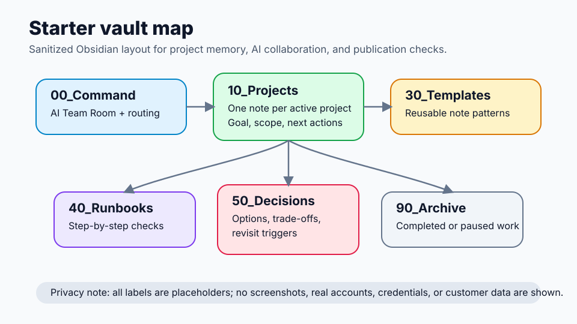

# Hermes x Obsidian Project OS Template

A public-safe starter kit for solo founders, OSS maintainers, and small teams who want a working **Hermes Agent + Obsidian + GitHub-style project workflow in about 3 minutes**.

Use it when project work is scattered across chats, issues, local notes, and half-remembered decisions. The goal is not to create a heavy process; it is to give you a lightweight operating system you can download, copy into a vault, and use immediately.

## Before / After

**Before:**

- Project context lives in one-off AI chats and gets lost between sessions.
- Decisions are made repeatedly because the original reasoning is not captured.
- Pull requests are opened before risks, tests, and publication boundaries are checked.
- AI assistants are asked to do everything, including work that should require human approval.

**After:**

- Each project has one clear note with goal, scope, next actions, and safety boundaries.
- Decisions are logged with options, trade-offs, and revisit triggers.
- PR readiness is checked before code or docs are published.
- AI collaboration is routed through explicit roles, handoffs, and gates.

## 3-minute usage example

1. **Get the files:** download the repository ZIP or clone it locally.
2. **Open the starter vault:** in Obsidian, choose **Open folder as vault** and select `starter-vault/`.
3. **Create a project note:** duplicate `starter-vault/30_Templates/project-note.md` into `starter-vault/10_Projects/<PROJECT_NAME>.md`.
4. **Set the work boundary:** fill in goal, in-scope items, out-of-scope items, and actions requiring human approval.
5. **Route AI work:** open `starter-vault/00_Command/AI Team Room.md` and assign a coordinator, implementer, and reviewer for the next task.
6. **Before publishing:** duplicate `starter-vault/30_Templates/pr-readiness.md`, check tests/safety, and record anything that should block the PR.

That is enough to start: one project note, one AI team room, and one readiness check.

## Visual tour

Prefer diagrams over screenshots for public docs. This repository includes a privacy-safe [Visual Tour](docs/visual-tour.md) with generic SVG examples that contain no private notes, account details, customer data, credentials, or real identifiers.



- [Starter vault map](assets/visual-tour/starter-vault-map.svg): shows how command notes, project notes, templates, runbooks, decisions, and archive folders fit together.
- [AI Team Room flow](assets/visual-tour/ai-team-room-flow.svg): shows the human → coordinator → implementer → reviewer → approval-gate loop.
- [PR readiness gate](assets/visual-tour/pr-readiness-gate.svg): shows the scope, checks, safety boundary, and maintainer handoff before publication.

See `docs/visual-tour.md` for the full explanation and suggested starter-vault usage.

## Why this exists

Many AI workflows are either too ad-hoc or too tied to one person's private notes. This template turns a real Hermes/Obsidian operating pattern into a reusable, public, secret-free starter kit.

## Who it is for

- Solo founders running several technical and business projects.
- Small teams using Obsidian as project memory.
- AI-agent users who need clear boundaries between implementation, review, and operations.
- OSS maintainers who want lightweight templates for project notes, PR readiness, routing, and scheduled jobs.

## What is included

```text
.
├── README.md
├── LICENSE
├── SECURITY.md
├── CONTRIBUTING.md
├── .github/
│   ├── ISSUE_TEMPLATE/
│   │   ├── bug_report.md
│   │   ├── docs_improvement.md
│   │   └── template_request.md
│   └── pull_request_template.md
├── templates/
│   ├── project-note.md
│   ├── decision-log.md
│   ├── pr-readiness.md
│   ├── ai-team-routing.md
│   ├── ai-team-room.md
│   └── cron-job-spec.md
├── examples/
│   ├── profile-routing.md
│   ├── sample-ai-team-room.md
│   ├── sample-project-note.md
│   ├── sample-pr-readiness.md
│   ├── walkthrough-oss-docs-improvement.md
│   └── vault-structure.md
├── assets/
│   └── visual-tour/
│       ├── ai-team-room-flow.svg
│       ├── pr-readiness-gate.svg
│       └── starter-vault-map.svg
├── starter-vault/
│   ├── 00_Command/
│   │   ├── AI Team Room.md
│   │   └── AI Team Routing.md
│   ├── 10_Projects/
│   │   └── Sample Project.md
│   ├── 30_Templates/
│   │   ├── ai-team-room.md
│   │   ├── ai-team-routing.md
│   │   ├── cron-job-spec.md
│   │   ├── decision-log.md
│   │   ├── pr-readiness.md
│   │   └── project-note.md
│   ├── 40_Runbooks/
│   │   └── PR Readiness Checklist.md
│   ├── 50_Decisions/
│   │   └── Sample Decision.md
│   └── README.md
└── docs/
    ├── publication-checklist.md
    └── visual-tour.md
```

## Quick start

Option A — Download ZIP and open the starter vault:

1. On GitHub, select **Code → Download ZIP**.
2. Unzip the repository somewhere local.
3. Open Obsidian.
4. Select **Open folder as vault**.
5. Choose the unzipped `starter-vault/` directory.
6. Duplicate the sample notes and replace placeholders like `<PROJECT_NAME>`.

Option B — Copy `starter-vault/` into your notes:

1. Copy the full `starter-vault/` directory into the folder where you keep Obsidian vaults.
2. Rename it for your project or team, if useful.
3. Open the copied folder in Obsidian.
4. Keep `30_Templates/` as your reusable templates and put active work in `10_Projects/`.

Option C — use the repository checkout directly:

1. Open Obsidian.
2. Select **Open folder as vault**.
3. Choose this repository's `starter-vault/` directory.
4. Duplicate the sample notes and replace placeholders like `<PROJECT_NAME>`.

Option D — copy templates into an existing vault:

1. Copy the `templates/` files into your Obsidian vault.
2. Create one project note from `templates/project-note.md`.
3. Record one decision with `templates/decision-log.md`.
4. Before publishing code, fill `templates/pr-readiness.md`.
5. If you use Hermes Agent profiles, adapt `templates/ai-team-routing.md` and `templates/ai-team-room.md`.
6. If you use scheduled jobs, document them with `templates/cron-job-spec.md` before automating.

## Suggested Obsidian vault structure

```text
00_Command/       # Operating rules and AI team routing
10_Projects/      # Active project notes
20_Business/      # Customer, pricing, strategy notes
30_Templates/     # Reusable templates
40_Runbooks/      # Operational procedures
50_Decisions/     # Decision logs and architecture records
90_Archive/       # Completed or paused work
```

See `examples/vault-structure.md` for a more detailed sanitized example.

## End-to-end walkthrough

For a concrete example, see `examples/walkthrough-oss-docs-improvement.md`.

For a diagram-first overview, see `docs/visual-tour.md`.

It shows how a small OSS README improvement moves through:

- a project note,
- an AI Team Room,
- a decision log,
- a PR readiness check,
- a final PR handoff.

The walkthrough is intentionally generic and public-safe: it uses placeholders, avoids private account details, and keeps publication behind human approval.

## Hermes Agent usage pattern

This template assumes three roles:

- **PM / coordinator**: breaks down work, sets boundaries, checks results.
- **Implementer**: writes code or documents in a local branch/workspace.
- **Reviewer / tester**: runs checks, summarizes failures, and blocks risky operations.

The template intentionally separates:

- local drafting from public publishing,
- reversible work from irreversible operations,
- public examples from private memory,
- placeholders from real account identifiers.

Use `templates/ai-team-room.md` or `examples/sample-ai-team-room.md` to run chat-style collaboration where every role states what it did, what it verified, and whether the work may pass the next gate.

## Security rules

Never put these into an Obsidian vault or public repository:

- `.env` files,
- API keys,
- GitHub tokens,
- organization IDs for paid services,
- private emails or phone numbers,
- customer data,
- production URLs that should not be public,
- screenshots containing account details.

Use placeholders such as `<PUBLIC_REPO_URL>` or `<MAINTAINER_NAME>` when preparing public drafts. Keep account-specific form answers, private plans, and non-public operational details outside the public repository.

## Publication status

Current status: **public starter kit**.

Done:

- OSS theme selected.
- README and templates drafted.
- Sanitized examples prepared.
- Starter Obsidian vault added.
- Publication checklist prepared.

Privacy note:

- This repository is intentionally generic and public-safe.
- No personal information or account-specific identifiers are stored here.

## Roadmap

- Add a small import script or checklist generator after user approval.
- Add more sanitized diagrams or placeholder-only mockups after checking that they contain no private data.
- Collect real usage feedback and improve templates.

## License

MIT. See `LICENSE`.
