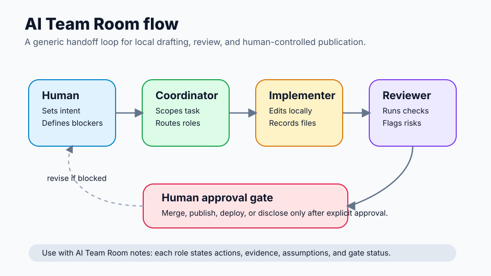
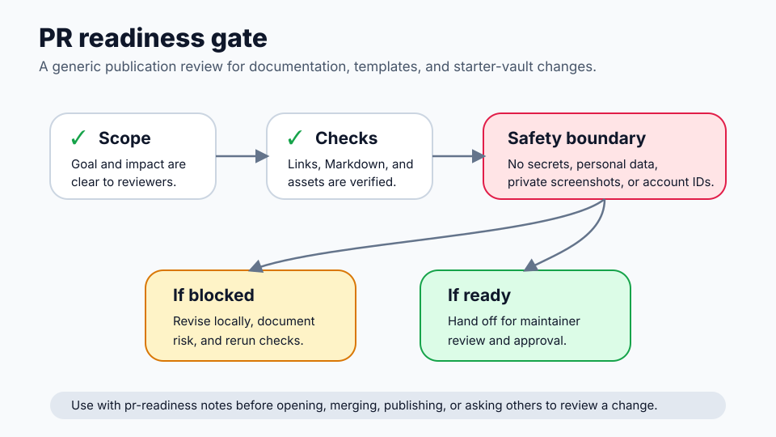

# Visual Tour

This page gives a privacy-safe visual overview of the starter vault. The diagrams are hand-drawn SVGs with generic labels only. They are not screenshots and do not contain private notes, account identifiers, customer data, production URLs, or credentials.

Use this tour when you want to understand the template before opening the vault in Obsidian.

## 1. Starter vault map

The starter vault map shows the main folders and their intended responsibilities:

- `00_Command/`: the operating area for AI Team Room notes and routing rules.
- `10_Projects/`: active project notes with goals, scope, next actions, and human-approval boundaries.
- `30_Templates/`: reusable note templates for projects, decisions, PR readiness, AI routing, team rooms, and cron job specs.
- `40_Runbooks/`: repeatable procedures such as publication checks or local review steps.
- `50_Decisions/`: decision logs that capture options, trade-offs, outcomes, and revisit triggers.
- `90_Archive/`: completed, paused, or superseded work.

How to use it:

1. Start in `10_Projects/` with one project note.
2. Pull reusable structure from `30_Templates/`.
3. Coordinate AI work from `00_Command/`.
4. Record durable decisions in `50_Decisions/`.
5. Use `40_Runbooks/` before publishing or doing repeated operational work.
6. Move stale or completed work to `90_Archive/`.

## 2. AI Team Room flow

The AI Team Room flow shows how a task moves through explicit roles:

- **Human:** states the goal, boundaries, and approval requirements.
- **Coordinator:** turns the goal into scoped work and assigns roles.
- **Implementer:** makes local changes and records what changed.
- **Reviewer:** checks quality, links, safety, and readiness.
- **Human approval gate:** blocks merge, publication, deployment, or disclosure until a maintainer approves.

How to use it:

1. Open `starter-vault/00_Command/AI Team Room.md` or duplicate `templates/ai-team-room.md`.
2. Fill in project, branch or workspace, related notes, and role assignments.
3. Have each role record actions taken, evidence, assumptions, and gate status.
4. If the reviewer finds a blocker, loop back to the coordinator or implementer.
5. Keep the final human approval checkpoint explicit.

## 3. PR readiness gate

The PR readiness gate shows the review pattern to run before a change is ready for maintainer attention:

- **Scope:** the change has a clear goal, affected files, and reviewer focus.
- **Checks:** Markdown, links, assets, and examples have been reviewed locally.
- **Safety boundary:** the change does not include secrets, personal data, private screenshots, customer details, production-only configuration, or real account identifiers.
- **If blocked:** revise locally, document the risk, and rerun checks.
- **If ready:** hand off for maintainer review and approval.

How to use it:

1. Duplicate `starter-vault/30_Templates/pr-readiness.md` or `templates/pr-readiness.md`.
2. Summarize the change and impact area.
3. Record checks run and known limitations.
4. Complete the safety review before public publication.
5. Leave human approval unchecked until a maintainer actually approves.

## Public-safety notes

These visuals intentionally use placeholders and generic labels. If you add your own images later, do not use screenshots that reveal:

- account names, user names, email addresses, or organization identifiers;
- tokens, keys, API responses, `.env` values, or internal URLs;
- customer, financial, medical, legal, or other sensitive data;
- private strategy notes or non-public operational plans.

Prefer sanitized diagrams, small mockups, or placeholder-only screenshots for public documentation.
